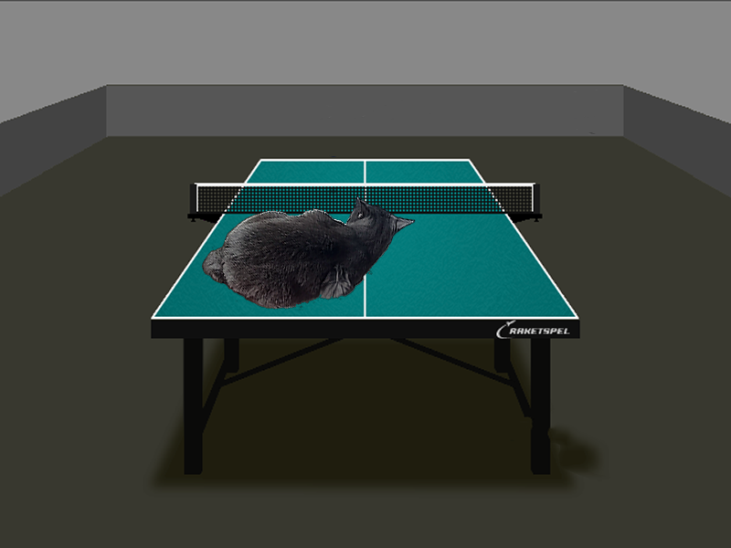

# Alpha Blending

This program merges two .bmp images.

Input:
<table style="border-style: none">
	<tr>
		<td></td>
		<td></td>
	</tr>
<table>

Output:

After looping the algorithms 10000 times we got the folowing runtimes:

The time gain is 6.4x!